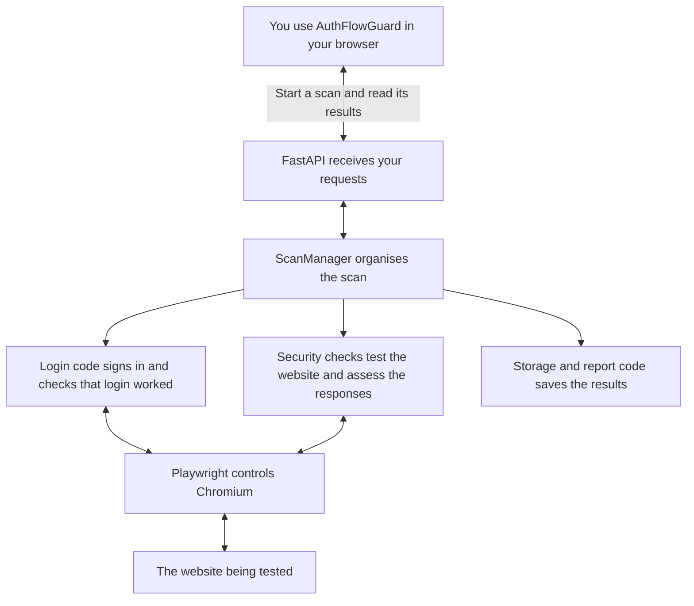
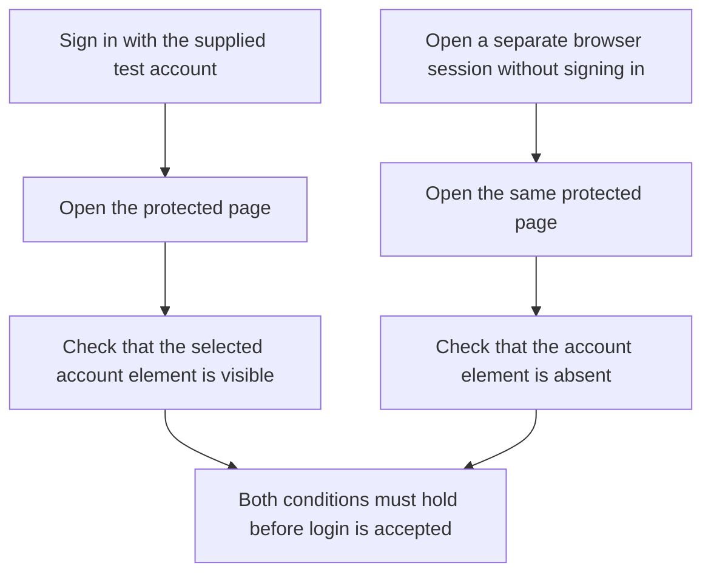
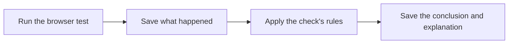
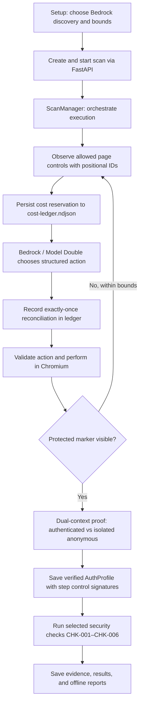

# How AuthFlowGuard Works

**Current implementation, checked on 14 September 2026**

AuthFlowGuard opens a website, signs in with the test account you provide, runs
the security checks you select, and explains the results. This document follows
that process and shows which parts of the backend do the work.

## 1. The main parts

There are two browsers involved. You use your normal browser to open
AuthFlowGuard and start a scan. The backend opens another browser, Chromium, to
visit and test the target website. Playwright is the library the backend uses to
control Chromium.

The **target website** means the application you want to test. It is separate
from AuthFlowGuard.

Read the diagram from the top. FastAPI receives requests from the interface and
passes them to ScanManager. ScanManager runs the login code first. Once login is
verified, it runs the selected checks and saves their results.

| Part | Its job |
| --- | --- |
| React interface | Collects your settings and displays progress and results |
| FastAPI | Provides the endpoints the interface calls to start, view, cancel, or reanalyse a scan |
| ScanManager | Decides what runs next and tracks whether the scan is running, waiting for help, finished, or failed |
| Login code | Finds the login fields, signs in, and confirms access to the account |
| Security checks | Test specific authentication behaviours and produce findings |
| Playwright and Chromium | Open pages, fill fields, click buttons, and observe responses |
| Storage and report code | Save the observations and results, then create downloadable reports |

## 2. What happens when you start a scan

### Step 1 — The backend receives your settings

In Setup, you enter the website address, allowed website origins, test account
details, and checks to run. You also identify a page that requires login and an
element on that page that should appear only for a signed-in user.

The interface first asks the backend to create a scan. The backend assigns a
scan ID and saves its settings. The interface then sends the account details in
a separate request to start that scan.

ScanManager starts the work in the background. While it runs, the Testing
screen asks the backend for an update every 1.5 seconds.

### Step 2 — The backend works out how to sign in

The backend opens the target website in Chromium and examines its form fields
and buttons. The current web application uses programmed rules to identify
these controls. For example, a password field can be identified by its HTML
input type.

If a previous completed scan has a matching saved login procedure, the backend
checks whether the page still has the expected fields and buttons. If they
match, it repeats the saved steps.

If it cannot identify the login procedure, or the saved procedure is outdated,
the scan pauses for guidance. You choose the login page, fields, and button in
the Discovery screen. The backend then tries those steps.

### Step 3 — The backend checks whether login actually worked

Opening a dashboard page is not enough to prove that login succeeded. The
backend compares access using two separate browser sessions:

For example, the selected element might be a section containing the signed-in
account's details. The code calls this an **account marker**.

Each browser session has its own cookies and storage. This prevents the
signed-out comparison from accidentally using the signed-in account's cookies.

After this comparison succeeds, the backend saves an **authentication profile**
called an AuthProfile. It contains the login steps, the protected-page details,
and references to the observations that proved login worked. Later checks can
use those steps to sign in again.

### Step 4 — The backend runs your selected security checks

Each check has two parts:

- The **runner** interacts with the website and records what happens.
- The **analyser** reads those observations and decides what they show.

The recorded observations are called **evidence**. They include the steps
attempted, relevant responses, comparisons, errors, and limits of the test.

For a logout check, the runner signs in, captures the session cookies, logs out,
and tries those captured cookies in a separate browser session. The analyser
then checks whether the old session still had access to the account.

ScanManager connects these parts in this order:

The analyser does not need to visit the website. Its input is the evidence
already collected by the runner.

### Step 5 — The backend saves the results

Each check returns its own outcome:

| Outcome | Meaning |
| --- | --- |
| Finding confirmed | The recorded evidence meets the check's conditions for a security issue |
| No issue observed | This test did not show the issue it was looking for |
| Inconclusive | The evidence is insufficient to reach a conclusion |
| Execution error | Something prevented the test from completing correctly |

A scan marked **completed** has finished its execution. Read the individual
outcomes to see what each check found.

The backend saves the results and creates JSON and HTML reports. The Results
screen shows the conclusions and provides download links.

## 3. Which security checks run?

The backend runs only the checks selected in Setup, in this order:

| Order | Check | What it tests |
| --- | --- | --- |
| 1 | CHK-001 — Login enumeration | Whether failed login responses reveal that an account exists |
| 2 | CHK-003 — Reset-request enumeration | Whether password-reset request responses reveal that an account exists |
| 3 | CHK-002 — Registration enumeration | Whether registration responses reveal that an account already exists |
| 4 | CHK-004 — Login throttling | How the website responds to a limited sequence of failed login attempts |
| 5 | CHK-005 — Session fixation | Whether cookies captured before login can provide account access after login |
| 6 | CHK-006 — Logout invalidation | Whether cookies captured before logout still provide account access afterwards |

Registration runs after login and reset enumeration because it can create the
test account that those earlier checks expect not to exist.

The checks use separate browser sessions where needed. A new browser session
does not reset changes made on the website, such as a created account or an
account lockout.

## 4. Where does the AI fit?

**Scans started from the web interface can use Bedrock AI discovery or deterministic rules (Task 2.6 / INT-011).**

When AI discovery is enabled in Setup, ScanManager delegates authentication
discovery to the `AutomaticBrowserController`. That controller interacts with
Playwright to observe page controls and requests actions from AWS Bedrock
(or an offline `DeterministicModelDouble` during tests).

### Key architectural boundaries and guarantees:

1. **Strict Security Boundary:**
   The React frontend communicates exclusively through FastAPI. React never calls
   AWS APIs directly and never receives or handles AWS credentials. AWS Bedrock
   configuration is validated synchronously by the backend prior to starting scans.

2. **Durable Cost Accounting:**
   Integrated with `CostLedger` and `CostLedgerStore`:
   - A price-book reservation is durably appended to `cost-ledger.ndjson` before
     each model dispatch.
   - If writing the reservation fails (e.g. disk write failure), execution halts
     immediately before calling AWS.
   - Model calls use a unique `request_id` for exactly-once reconciliation.
   - Reconciliations are recorded upon successful response or upon model error
     (`BedrockResponseError`), ensuring all consumed tokens are permanently accounted for.
   - Unreconciled reservations survive restart and are restored from the ledger.

3. **Multi-Page Replay and Control Signatures:**
   AI exploration can navigate through intermediary pages (e.g. landing page to login).
   Every step captures a non-secret `step_control_signatures` dictionary. Replay and
   revalidation engines validate the targeted control on the live page before executing
   each action, rejecting tampered or stale elements with `StaleAuthProfileError`.

4. **Independent Dual-Context Authentication Proof:**
   Reaching an account marker is not accepted on its own. The controller verifies
   marker visibility in a dedicated authenticated context and tests the same resource
   in an isolated anonymous context. If the marker is visible anonymously, the proof
   is rejected.

5. **Deterministic Security Analysis:**
   The AI agent is used only for authentication discovery and navigation. The security
   analysers themselves (CHK-001 through CHK-006) remain 100% deterministic rule-based
   engines that process structured offline evidence packages.

## 5. Where is the scan data stored?

The backend saves files under **.authflowguard-data/** in the project directory.
Each scan has its own folder. There is currently no database server.

| Saved file or folder | Contents |
| --- | --- |
| metadata.json | Scan settings, current state, exploration metrics, and any scan error |
| auth-profile.json | Login steps, step signatures, and dual-context proof references |
| cost-ledger.ndjson | Append-only durable reservations and reconciliations |
| events.ndjson | Recorded browser activity and observations |
| checks/ | Evidence collected for each check |
| results/ | Saved conclusions, including results from later reanalysis |
| report.json and report.html | Downloadable reports |

**Reanalysis** means applying the analysers to the existing evidence again.
It does not visit the website or repeat the browser tests. It saves new results,
keeps earlier result files, and updates the reports.

The backend already provides a reanalysis endpoint. The interface button is
still to be added.

## 6. What is still unfinished?

These details matter when reading the diagram or assigning the remaining work:

| Area | Current position |
| --- | --- |
| AI integration | Offline web login integration is implemented and under review (Task 2.6 / INT-011); live UI-to-Bedrock validation remains outstanding. Broader AI discovery of registration/reset flows remains future work |
| Background execution | Scan jobs run in one background thread within the backend program. Moving them into a separate worker process is planned |
| Cancellation | The backend has cancellation handling, but stopping every active browser operation still needs work |
| Credential handling | Credentials are supplied through temporary in-memory objects. Complete cleanup on every exit path and checks for leaks in exports remain open work |
| Session checks | CHK-005/006 currently support username/password login with cookie sessions. OTP and bearer-token replay are not supported by these checks |
| Logout detection | CHK-006 currently identifies logout through a form that produces a POST response |
| Restart recovery | Saved scans can be loaded again. A scan that was running or waiting for guidance is marked failed after a restart |

See [DEVELOPMENT.md](DEVELOPMENT.md#current-support-boundary) for the session-check
limitations in more detail.

## 7. Where to look in the code

Read the first three entries in order to follow a scan from the interface to the
login procedure.

| File | What to look for |
| --- | --- |
| [app.py](../backend/authflowguard/app.py) | The endpoints used to create, start, view, cancel, and reanalyse scans |
| [scan_manager.py](../backend/authflowguard/scan_manager.py) | The order of work: login, selected checks, saved evidence, results, and reports |
| [automatic_actions.py](../backend/authflowguard/automatic_actions.py) | AI exploration loop, step signatures, retry policy, and durable cost accounting |
| [model_double.py](../backend/authflowguard/evaluation/model_double.py) | Offline deterministic model double for automated testing without AWS calls |
| [cost_tracking.py](../backend/authflowguard/evaluation/cost_tracking.py) | Durable cost ledger and store for reservations and reconciliations |
| [authentication.py](../backend/authflowguard/authentication.py) | Finding login fields, executing login steps, asking for guidance, and comparing account access |
| [auth_profiles.py](../backend/authflowguard/auth_profiles.py) | The conditions that must hold before a login profile is accepted |
| [action_executor.py](../backend/authflowguard/action_executor.py) | How a browser action is validated and performed |
| [playwright_worker.py](../backend/authflowguard/playwright_worker.py) | How page controls, requests, cookies, and storage are observed |
| [checks/](../backend/authflowguard/checks/) | The six check implementations and their analysers |
| [models.py](../backend/authflowguard/models.py) | The data structures passed between the components |
| [scope.py](../backend/authflowguard/scope.py) | Helpers for checking allowed website origins and cleaning URLs |
| [secrets.py](../backend/authflowguard/secrets.py) | Looking up supplied credentials by reference and clearing their stored copy |
| [evidence.py](../backend/authflowguard/evidence.py) | Saving and loading evidence, profiles, and results |
| [reports.py](../backend/authflowguard/reports.py) | Creating the JSON and HTML reports |
| [agent_cli.py](../backend/authflowguard/agent_cli.py) | Starting the separate AI browser agent from the terminal |
| [bedrock.py](../backend/authflowguard/bedrock.py) | Preparing model requests, validating responses, and checking estimated cost |

The `authflowguard.evaluation_targets` package contains the three bundled test
applications: controlled_app.py, react_json_app.py, and site_app.py. They run as
separate websites and give AuthFlowGuard something to
test; they are not parts of the scan manager.

## Bedrock web integration validation (23 September 2026)

Frontend scans route through FastAPI, ScanManager, the browser controller, dual-context authentication proof, and the existing check pipeline. This is offline integration status; a live UI-to-Bedrock scan remains unverified.
