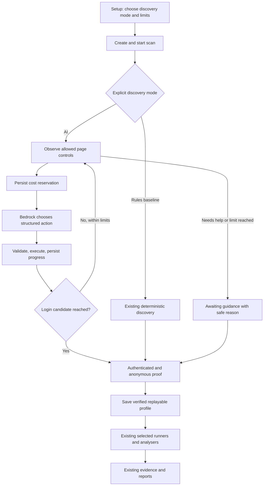

# Bedrock-driven web scans: implementation handoff

Prepared 23 September 2026 from the current repository. This is an implementation
specification for another agent, not a record of completed integration. No live
AWS calls or test runs were performed while preparing it.

## 1. Objective and completion boundary

Connect the existing Bedrock browser controller to scans started from the React
interface. A user must be able to choose AI discovery, start a bounded scan,
watch real progress, obtain a verified authentication profile, and run the
existing selected security checks through the existing evidence/report pipeline.

Implement the work; do not stop after adding UI controls or calling the terminal
command. Reuse the Python controller directly. Keep FastAPI as the only frontend
connection: React must never call AWS or receive AWS credentials.

This completes an omitted part of the original project scope. Suggested tracking:
**Task 2.6 / INT-011 — Connect Bedrock discovery to web scans**, owned by Member 2
with Team Lead review. These are proposed identifiers, not existing assignments.
Keep INT-006's standalone-controller evidence; do not use it as proof that INT-011
is complete. Update the shared trackers when implementation begins.

First delivery covers AI discovery of login, including navigation to login from
an in-scope entry page, and its integration with the existing check pipeline.
It does not establish general AI discovery of registration/reset/logout, extend
the supported authentication types of every runner, or make AI security verdicts.
Leave those boundaries explicit in documentation.

## 2. Read first and preserve

Read PROJECT_PLAN_AI.md, ARCHITECTURE.md, EXECUTION_PLAN_AI.md,
WORK_BREAKDOWN_STRUCTURE.md, SESSION_HANDOFF.md, KNOWN_LIMITATIONS.md, and
DEVELOPMENT.md in this directory. Check current instructions, git status, and
code before editing; another agent may have made changes since this handoff.

Members 3 and 5's delivered work is already present:

| Existing work | Integration requirement |
| --- | --- |
| Application C in `backend/authflowguard/evaluation_targets/site_app.py` | Preserve its independent two-form layout. Do not simplify it or hardcode its controls to make AI succeed. |
| `evaluation/cases/formal_cases.json` | Preserve it as an immutable run input. Do not rewrite expected outcomes to manufacture passes. Document separately any reviewed expectation correction. |
| Formal evaluation and offline verification modules | Extend their mode selection and provenance; retain fresh fixtures per case and ephemeral ports. |
| `evaluation/cost_model.py` and `cost_tracking.py` under the Python package | Reuse their price/ledger contracts and live/mock distinction. Do not introduce a conflicting price table or fabricated usage. |
| Existing reports and raw result manifests | Preserve the historical baseline. New runs get new IDs and filenames. |
| Six check runners, deterministic analysers, JSON/HTML reports | Keep their semantics, evidence contracts, and offline operation. |

Member 5's documented baseline is 44 cases, 41 passing; web discovery A 5/5,
B 2/5, C 0/5 automatic (C 5/5 guided). These are historical rule-based results,
not fresh measurements and not AI results. B's CHK-001 native-form assumptions,
the session-check OTP/bearer limitations, and non-POST logout limitations remain
real even if AI successfully logs in.

Reproduce the reported React/JSON fixture failure before diagnosing it. The
handoff also reports an `httpx`/`httpx2` mismatch: inspect the installed versions,
imports, and reproducible collection error before changing dependencies. Neither
claim should be assumed to describe every new environment.

## 3. Existing seams to use

Paths below are relative to the repository root.

| File | Relevant seam |
| --- | --- |
| `frontend/src/App.tsx` | SetupView creates a scan then calls `/start`; DiscoveryView submits guidance; TestingView polls snapshots. |
| `backend/authflowguard/app.py` | `create_app`, API routes, and ScanManager construction. |
| `backend/authflowguard/models.py` | `ScanRequest`, `ExecutionLimits`, `BrowserAction`, `DiscoveryRecord`, `AuthProfile`. |
| `backend/authflowguard/scan_manager.py` | `_run_scan_async`, `_complete_profile_execution`, `_find_saved_profile`, persistence and `snapshot`. |
| `backend/authflowguard/automatic_actions.py` | `AutomaticBrowserController`, `ActionSelectionClient`, controller results and limits. |
| `backend/authflowguard/bedrock.py` | `BedrockConfiguration`, structured Converse client, response validation and pricing. |
| `backend/authflowguard/authentication.py` | `VerifiedLoginExecution`, authentication proof, action sanitization, profile replay/revalidation. |
| `backend/authflowguard/agent_cli.py` | Existing controller construction example; keep this CLI working. |
| `backend/authflowguard/playwright_worker.py` and `action_executor.py` | Observations, positional control IDs, permitted actions and scope enforcement. |
| `backend/authflowguard/evidence.py` and `reports.py` | Existing append-only evidence and offline report storage. |

Current `_run_scan_async` chooses saved-profile replay or
`execute_verified_login_flow`, which uses deterministic form matching. The AI
controller currently has no cancellation input, returns decisions rather than
a verified profile, and buffers evidence until return. Its progress callback
fires after successful browser execution, so it cannot account for every model
request. `BedrockActionClient.choose_action` validates the action before reading
usage; an invalid response can still have incurred model charges.

## 4. Required flow



The guidance arrow includes execution of submitted steps in a fresh context
before proof. A controller completion condition is only a candidate for proof;
it must never bypass the signed-in/signed-out comparison. Cancellation from any
active stage takes precedence over subsequent completion callbacks.

## 5. Implementation sequence

### A. Establish the baseline and explicit contracts

1. Run existing checks before edits and record actual results. Preserve user
   changes. Separate reproduced existing failures from new regressions.
2. Add a persisted discovery mode, e.g. `bedrock` and `rules`, to ScanRequest.
   Legacy requests/artifacts missing the field should retain rule-based behavior.
   New frontend scans should explicitly choose `bedrock` by default, subject to
   backend configuration being available. Provide an explicitly labelled rules
   baseline option. Never silently downgrade an AI request to rules.
3. Add an explicit saved-flow reuse option. For a new AI discovery run and all
   discovery benchmarks, default reuse off so an old profile cannot bypass AI.
   Reuse, when selected, must be shown as replay, not new AI discovery. Preserve
   legacy replay behavior for old clients where practical and test it.
4. Keep existing `profile_source` compatibility (`automatic`/`guided`) if useful,
   but add unambiguous discovery provenance: requested mode, actual engine,
   live/mock source, reused profile, and whether guidance was needed. A profile
   originally discovered with AI does not mean this scan made an AI call.
5. Define safe snapshot fields for phase, decision/request counts, token totals,
   estimated usage cost, unresolved reservations, stop reason, and provenance.
   Use existing scan states plus a phase field; avoid a second competing state
   machine. Old saved scans must still load. Metadata parsing currently removes
   known fields before strict ScanRequest validation: update it deliberately so
   adding runtime metadata cannot silently make scans disappear on reload.

### B. Backend configuration and dependency injection

1. Load AWS profile, region, model ID and request limits from server-side
   configuration. Document exact names/defaults you implement. Reuse
   BedrockConfiguration; validate model pricing without making a paid request.
2. Inject an action-client factory/configuration through create_app and
   ScanManager. Instantiate lazily for AI scans, not at module import. Offline
   reanalysis, health checks, rule-based scans and tests must need no AWS access.
3. Add a small read-only capability endpoint (suggested `/api/capabilities`)
   exposing configuration availability, safe model display information and
   supported limits. “Configured” must not imply live access or quota verified.
   Do not return credentials, local credential paths, or raw AWS exceptions.
4. Apply server-side maximum limits as well as user-selected lower limits.
   Keep per-request caps and total scan caps distinct. Configuration errors
   should reject AI start clearly before browser work; runtime service failures
   should follow the controller's bounded guidance path.

### C. Turn AI execution into verified authentication

1. Add a reusable function, e.g. `execute_ai_verified_login_flow`, returning the
   existing VerifiedLoginExecution shape on successful proof. Accept injected
   client, limits, cancellation, and event/usage sinks. Do not shell out to CLI.
2. Run AutomaticBrowserController on the same authenticated page/context used
   for subsequent proof. Avoid duplicate initial navigation: the controller
   currently navigates itself. Ensure its completion probe does not navigate
   away from a partially completed login on every decision.
3. Track successfully executed actions separately from proposed decisions.
   Include initial navigation, waits, and intermediate navigation needed for
   replay. Do not record a failed action as successful. Reuse action sanitization
   and credential references; never persist filled credential values.
4. After candidate completion, explicitly open the configured protected resource,
   collect account-marker and session evidence, compare against an isolated
   anonymous context, then call the existing profile builder. Extract shared
   proof code if necessary rather than duplicating weaker verification.
5. Capture page-specific control signatures for multi-page flows. Existing
   revalidation compares all signatures with one initial page; do not merge
   positional `control-1` identifiers from different pages into one dictionary.
   Introduce backward-compatible step/page validation, verify controls before
   each replay action, and reject stale/ambiguous actions safely. Test dynamic
   DOM changes between observation, model response, execution, and replay.
6. Inspect observation sufficiency. The current model sees control attributes
   but lacks some human-visible link/button labels and form context. Add only
   bounded, sanitized metadata needed to distinguish controls and reach login.
   Keep IDs consistent with execution. Treat all page text as untrusted data;
   no generated JavaScript, arbitrary selectors, or scope changes from the model.
7. Review the current completed-fill tracking against multi-page positional IDs;
   reset it on genuine page/control changes so an unrelated later `control-1`
   is not hidden from the model. Bound observation reads under the active deadline.
8. Return or persist partial evidence on guidance, timeout, invalid action, cost
   limit and service failure. Do not lose it by only raising ValueError.

### D. Integrate ScanManager and preserve existing checks

1. Dispatch explicitly by requested mode; use the new AI verification function
   for AI discovery and retain deterministic discovery for baseline runs.
2. On verified success, call `_complete_profile_execution`. Preserve selected
   checks, analyser functions, evidence/result versions, and check ordering.
   Login/reset enumeration must still precede registration because registration
   can create the supposedly nonexistent account.
3. Persist progress incrementally through the existing event store, once per
   event ID. Avoid appending the same events again when the final result returns.
   Make polling snapshots safe while the worker updates them.
4. Map controller guidance and limit outcomes to awaiting_guidance with a safe,
   actionable reason; no security checks may start before proof. Preserve the
   existing fresh-context guided submission path and its limitations. AI progress
   must not imply that guidance resumes a browser context already closed.
5. Inspect downstream replay assumptions in login enumeration, throttling,
   and session-check adapters. AI may produce navigation/click steps before
   credential fills. Support safe replay needed by the existing cookie/form
   checks or return an explicit unsupported/error result before a wrong action.
   Never assume every fill after the first is a password. Do not claim OTP,
   bearer replay, or generalized logout support merely because discovery works.
6. Preserve offline reanalysis and download: neither may instantiate a Bedrock
   client, browse the target, or spend tokens.

### E. Cancellation, secrets, and durable accounting

1. Thread cancellation through discovery, observations, model waits, browser
   execution and proof. Check before each paid request and browser action.
   Close browser resources and discard credentials on every terminal path.
2. `asyncio.to_thread` cancellation does not kill a running synchronous SDK call.
   Bound SDK connect/read timeouts and retry policy. A late response may update
   accounting, but must not trigger another action or overwrite cancelled state.
   Do not declare full worker termination solved: RUN-002 remains separate.
3. Clear all copies of secret-bearing execution inputs on terminal outcomes,
   including pending_execution and retained task arguments. While awaiting
   guidance, retain only the in-memory input necessary for the existing workflow;
   cancellation must discard it. Backend restarts must require fresh secrets.
4. Reuse CostLedger/CostLedgerStore and UsageSource. Identify entries by scan,
   model request and workflow. Extend compatible contracts where necessary;
   preserve Member 5's tests and evaluation imports.
5. Add a durable request lifecycle: reservation persisted before dispatch,
   response usage persisted whenever available, reservation reconciled once.
   The success-after-browser-action callback is insufficient: capture usage
   even when action validation or execution fails. A malformed response with
   valid usage still counts. Prevent duplicate accounting on retries/reloads.
6. Keep unknown usage distinct from zero. A timed-out or interrupted paid request
   retains an unresolved reservation until reconciled; do not invent token
   counts. Budget enforcement uses observed cost plus outstanding reservations.
   Mock counts are never labelled live and price-derived estimates are not an
   AWS billing invoice. Record the pricing basis used for reproducible totals.
7. Reload usage and reservations after restart while preserving the current
   policy that interrupted scans fail rather than automatically resume. Make
   ledger write failure stop further paid work. Test partial-tail/recovery
   behavior; never silently reset a damaged ledger to a zero budget.
8. Apply privacy checks to outbound observations as well as evidence. URL
   query removal alone is insufficient: titles/labels can echo entered secrets.
   Redact known secret values, omit cookies/tokens/raw responses and input values,
   and enforce existing origin checks through redirects and browser requests.

### F. Frontend behavior

Preserve the current visual system in PRODUCT.md and DESIGN.md. This is a focused
workflow change for developers operating scans, not a redesign or an AWS console.

1. Setup: show “AI discovery (Bedrock)” and “Rule-based discovery (baseline)”,
   configuration status, cost/action/time limits, and saved-flow reuse choice.
   Explain that starting AI discovery sends sanitized page descriptions to AWS
   and may incur usage cost. No repeated confirmation modal is necessary.
2. If AI is unconfigured, explain the required backend setup and let the user
   explicitly select the baseline. Do not silently change the selected mode.
   Preserve existing credentials, protected-resource and account-marker inputs.
3. Submit discovery options and ExecutionLimits in the scan request; keep live
   secrets in the existing transient start payload. Do not put them in browser
   storage, URLs, event text, or usage displays.
4. Testing/Discovery: display actual phase (discovering, verifying, checking),
   safe recent actions, decisions and usage. Distinguish measured token counts,
   estimated cost, and unknown reservations. Do not invent percentage progress.
5. Provide a clear stop reason and existing guidance action when paused. Keep
   cancellation reachable while awaiting the model, and prevent double starts.
   Poll the existing snapshot/events APIs; SSE is unnecessary for this delivery.
6. Results: show AI/rules/guided/replay provenance and source of usage. Completed
   login is not a security pass. Keep result outcomes and evidence visible.
7. Use labelled keyboard-accessible controls and textual statuses. Test loading,
   missing configuration, service failure, guidance, cancel, completion and reload.
   Inspect desktop/mobile once, fix observed issues together, and confirm once.

## 6. Evaluation and test requirements

Tests must use injected model doubles by default. No default test command or
baseline evaluation may unexpectedly contact AWS.

| Layer | Required evidence |
| --- | --- |
| Controller/client | Cancellation, deadlines including observation, bounded retry, invalid/stale actions, secret redaction, usage on validation/execution failure, no action after cancellation. |
| Authentication | AI actions yield a verified profile; an anonymous-visible marker fails proof; successful steps replay fresh; multi-page IDs and stale controls cannot target another field. |
| API/manager | `/create` then `/start` drives the real controller with an injected double, emits progress, proves login, executes selected checks and produces downloadable reports. |
| Persistence | Old scans load; new provenance and ledger survive restart; interrupted work remains failed; partial evidence survives; no duplicated events/cost or leaked secrets. |
| UI | Explicit modes/limits in payload, safe capability errors, progress/usage, guided fallback, cancellation and replay provenance. |
| Evaluation | Fresh fixtures/ports; rules baseline remains offline; AI mode has distinct outputs; discovery measurements cannot be satisfied by saved-flow replay. |

Extend existing tests in `test_automatic_actions.py`, `test_bedrock.py`,
`test_authentication.py`, `test_app.py`, `test_enumeration_scans.py`,
`test_evaluation_cost.py`, `test_evaluation_failures.py`, and `App.test.tsx`.
Add a focused integration module if this keeps the tests clearer.

Use A for a full supported login-to-check-to-report test. Use B to exercise
dynamic two-step discovery independently of its unsupported native-form checks.
Use C to exercise disambiguation of two forms, with no fixture-name or port
special cases. Also cover entry-page-to-login navigation. Scripted doubles prove
orchestration, not a live model's ability to discover those layouts.

Extend `case_runner.py` and `discovery_reliability.py` with explicit discovery
mode and client configuration/injection. Preserve the baseline default as rules.
A live mode needs deliberate opt-in and a total evaluation budget, not just a
per-scan cap. Record live/mock, engine, model/configuration, guidance and failure
reasons per attempt. Measure discovery separately from runner compatibility so
Application B's CHK-001 limitation is not counted as failed AI navigation.

Write new outputs such as `discovery-bedrock-<run-id>.md` and
`measurements-bedrock-<run-id>.md`. Do not overwrite Member 5's published baseline.
Run five fresh discovery attempts per application only when live AWS access and
the explicit evaluation budget are available. Report actual outcomes; do not
promise C will pass or relabel mock results as live reliability measurements.

Run verification from the repository root:

```powershell
.\.venv\Scripts\python -m pytest
.\.venv\Scripts\python -m ruff format --check backend
.\.venv\Scripts\python -m ruff check backend
.\.venv\Scripts\python -m mypy
npm.cmd --prefix frontend run check
```

Also rerun formal cases and offline verification using DEVELOPMENT.md and
SESSION_HANDOFF.md commands with new output paths/run IDs. Record commands and
results. Investigate new failures; document reproduced baseline failures rather
than hiding, deleting or automatically reclassifying them. Reconfirm model
availability, quotas and pricing from official AWS documentation before changing
AWS behavior or publishing new live cost claims.

## 7. Acceptance and final handoff

The implementation is complete when all of the following hold:

- A frontend-started AI scan demonstrably invokes the controller through the
  normal API/ScanManager path; a UI toggle with no backend routing does not count.
- Authentication proof gates the unchanged selected-check/report pipeline.
- Rule-based runs, guided runs, replay and historical artifacts remain usable
  and are accurately distinguished from new AI discovery.
- Cancellation, model failure and limits preserve evidence, usage and safe
  outcomes; secrets are absent from model requests and persisted/public outputs.
- Member 3's target/cases and Member 5's ledger/evaluation tools remain intact;
  fresh AI reports are separate from historical baseline results.
- Offline integration/quality checks pass, or any unresolved baseline issue is
  reproduced and specifically documented with its impact.
- A bounded real UI-to-Bedrock smoke run is recorded if AWS access is available.
  If unavailable, label the result “offline integration verified; live validation
  blocked” and state the blocker. Do not claim live completion from a mock.

Update ARCHITECTURE.md, KNOWN_LIMITATIONS.md, DEVELOPMENT.md, the execution
tracker and WBS to match actual behavior. Preserve dated evaluation claims;
update SESSION_HANDOFF.md with the new state without erasing Member 5's results.
Document deferred worker-process work and check-specific unsupported features.

Final implementation report: files changed, end-to-end behavior, exact test
results, live versus mock evidence, cost basis/budget used, unresolved limitations
and new evaluation artifact paths. Do not mark work done solely because a model
returned an action or the account marker appeared.
